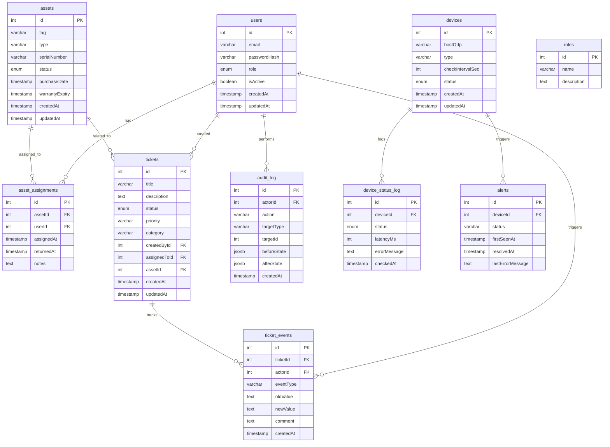

# Entity Relationship Diagram

```mermaid
erDiagram
    users ||--o{ asset_assignments : has
    users ||--o{ tickets : created
    users ||--o{ ticket_events : triggers
    users ||--o{ audit_log : performs

    assets ||--o{ asset_assignments : assigned_to
    assets ||--o{ tickets : related_to

    tickets ||--o{ ticket_events : tracks

    devices ||--o{ device_status_log : logs
    devices ||--o{ alerts : triggers

    users {
        int id PK
        varchar email
        varchar passwordHash
        enum role
        boolean isActive
        timestamp createdAt
        timestamp updatedAt
    }

    roles {
        int id PK
        varchar name
        text description
    }

    assets {
        int id PK
        varchar tag
        varchar type
        varchar serialNumber
        enum status
        timestamp purchaseDate
        timestamp warrantyExpiry
        timestamp createdAt
        timestamp updatedAt
    }

    asset_assignments {
        int id PK
        int assetId FK
        int userId FK
        timestamp assignedAt
        timestamp returnedAt
        text notes
    }

    tickets {
        int id PK
        varchar title
        text description
        enum status
        varchar priority
        varchar category
        int createdById FK
        int assignedToId FK
        int assetId FK
        timestamp createdAt
        timestamp updatedAt
    }

    ticket_events {
        int id PK
        int ticketId FK
        int actorId FK
        varchar eventType
        text oldValue
        text newValue
        text comment
        timestamp createdAt
    }

    devices {
        int id PK
        varchar hostOrIp
        varchar type
        int checkIntervalSec
        enum status
        timestamp createdAt
        timestamp updatedAt
    }

    device_status_log {
        int id PK
        int deviceId FK
        enum status
        int latencyMs
        text errorMessage
        timestamp checkedAt
    }

    alerts {
        int id PK
        int deviceId FK
        varchar status
        timestamp firstSeenAt
        timestamp resolvedAt
        text lastErrorMessage
    }

    audit_log {
        int id PK
        int actorId FK
        varchar action
        varchar targetType
        int targetId
        jsonb beforeState
        jsonb afterState
        timestamp createdAt
    }
```
